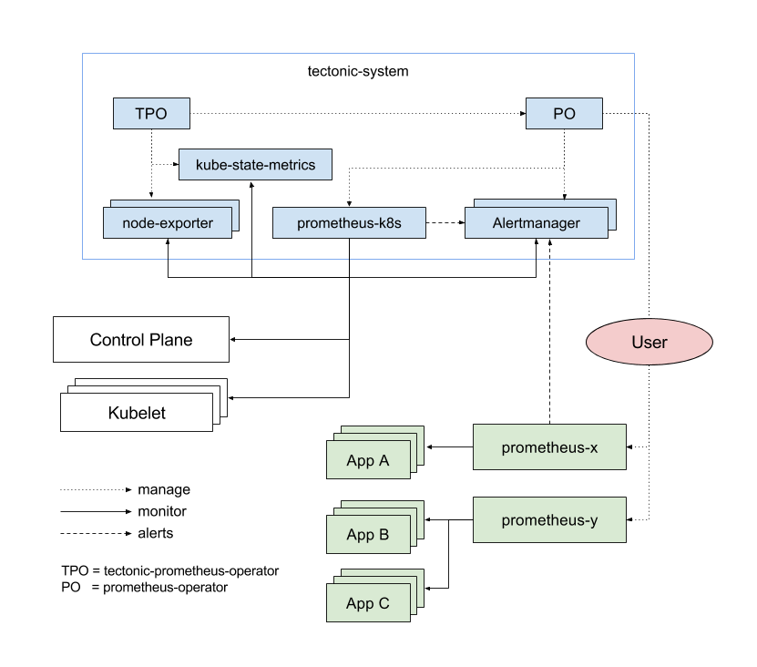

# Cluster Monitoring

Cluster monitoring ships with a pre-configured and self-updating monitoring stack that is based on the [Prometheus][prometheus] open source project and its wider eco-system. It provides monitoring of cluster components and ships with a set of alerts to immediately notify cluster admins about any occurring problems.

## Overview

At the heart of the monitoring stack sits the Cluster Monitoring Operator, which watches over the deployed monitoring components and resources, and ensures that they are always up to date.

One of the core components that Cluster Monitoring ships is the [Prometheus Operator][prom-operator]. The Prometheus Operator creates, configures, and manages Prometheus monitoring instances. It automatically generates monitoring target configurations based on familiar Kubernetes label queries.

## Cluster Monitoring

A Prometheus instance dedicated to monitoring the Cluster cluster itself is also shipped, controlled by the Prometheus Operator. This instance includes a set of alerting rules to notify operators about problems in a cluster.

Use the Prometheus [Alertmanager][alertmanager] to send notifications to operators. Cluster Monitoring includes a highly available cluster of the Alertmanager, meant to be used not only by the Prometheus instance monitoring the cluster, but rather by all Prometheus instances.

In addition to Prometheus and Alertmanager, Cluster Monitoring also includes [node-exporter][node-exporter] and [kube-state-metrics][kube-state]. Node-exporter is an agent deployed on every node to collect metrics about it. The kube-state-metrics exporter agent converts Kubernetes objects to metrics consumable by Prometheus.

The targets monitored as part of the cluster monitoring are:

- Prometheus itself
- Prometheus-Operator
- Alertmanager cluster instances
- Kubernetes apiserver
- kubelets (the kubelet embeds cAdvisor for per container metrics)
- kube-scheduler
- kube-controller-manager
- kube-state-metrics
- node-exporter

All these components are automatically updated.

Cluster Monitoring is also configurable, learn how to [configure Cluster Monitoring][configure-monitoring].

> Note that in order to be able to deliver updates with guaranteed compatibility, configurability of the Cluster Monitoring stack is limited to the explicitly available options. Read more on [update and compatibility guarantees][update-and-compatibility-guarantees].

## Application Monitoring

Create additional Prometheus instances managed by the Prometheus Operator to monitor individual applications.

## Accessing Prometheus and Alertmanager

Cluster Monitoring ships with a Prometheus instance for cluster monitoring and a central Alertmanager cluster. In addition to Prometheus and Alertmanager, Cluster Monitoring also includes a [Grafana][grafana] instance as well as pre-built dashboards for cluster monitoring troubleshooting.

By default, all web UIs are exposed through Kubernetes Ingress, and accessible at the following names:

- Prometheus: https://$CLUSTER-DNS/prometheus
- Alertmanager: https://$CLUSTER-DNS/alertmanager
- Grafana: https://$CLUSTER-DNS/grafana

Authentication is performed against the OpenShift identity system, and uses the same credentials or means of authentication as is used elsewhere in OpenShift.

[alertmanager]: https://prometheus.io/docs/alerting/alertmanager/
[grafana]: https://grafana.com/
[configure-monitoring]: user-guides/configuring-cluster-monitoring.md
[node-exporter]: https://github.com/prometheus/node_exporter
[kube-state]: https://github.com/kubernetes/kube-state-metrics
[prom-operator]: https://coreos.com/operators/prometheus/docs/latest/
[prometheus]: https://prometheus.io/
[update-and-compatibility-guarantees]: user-guides/update-and-compatibility-guarantees.md
