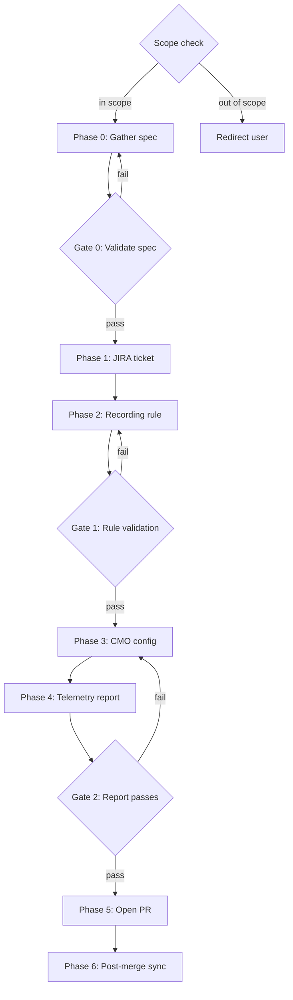

# Add a Telemetry Signal to OCP

## When to use

Use this skill when a user wants to send a new metric from an OpenShift cluster
to Red Hat Telemetry (Telemeter), or modify an existing telemetry metric.
Typical triggers:

- "I want to add metric X to telemetry"
- "I want to add a label to an existing telemetry metric"
- "How do I ship a metric via Telemeter?"
- A JIRA ticket with label `telemetry-review-request`
- A request to modify `manifests/0000_50_cluster-monitoring-operator_04-config.yaml`

## Overview

Telemetry collects anonymized metrics from all connected OpenShift clusters.
The Telemeter client in `openshift-monitoring` reads metrics from in-cluster
Prometheus via `/federate` and forwards them to the Telemetry server.

Only metrics already scraped by the in-cluster monitoring stack can be shipped.
All telemetry metrics **must** be exposed through recording rules to:

1. Strip volatile labels (`instance`, `pod`) that inflate cardinality.
2. Explicitly pin label values to guard against future label set expansion.
3. Protect the telemetry backend from unexpected cardinality growth.

Reference: https://rhobs-handbook.netlify.app/products/openshiftmonitoring/telemetry.md/

## Scope check

Before proceeding, determine if this request is in scope for this skill:

**In scope** (standard OCP telemetry via telemeter client):
- The component runs on a standard OCP cluster.
- Metrics are scraped by the in-cluster monitoring stack (Prometheus).
- The telemeter client in `openshift-monitoring` forwards them to the
  Telemetry server.
- The CMO telemetry config controls which metrics are shipped.

**Out of scope** (different telemetry paths):
- **MicroShift**: Uses direct-write to the Telemeter server, no telemeter
  client. Configuration goes to `rhobs/configuration`, not CMO. Redirect
  the user to the MicroShift telemetry documentation.
- **Standalone Telemeter server config**: Some components bypass CMO
  entirely. Redirect to `#forum-observatorium`.

If out of scope, inform the user and stop.

## Prerequisites

- A local checkout of `openshift/cluster-monitoring-operator` (this repo).
- The component exposing the raw metric must already be instrumented and
  scraped by the in-cluster monitoring stack via `ServiceMonitor` or
  `PodMonitor` in a namespace with `openshift.io/cluster-monitoring=true`.
- Access to a running OpenShift cluster with `KUBECONFIG` set (for the
  telemetry report tool validation).

## Process



---

## Phase 0: Gather the telemetry spec

Collect the following information from the user. Use the spec template in
`telemetry-spec.example.json` (in this skill's directory) as a reference.

### Required fields

**Per metric** (repeat for each metric in the request):

| Field | Description |
|-------|-------------|
| `metric_name` | The raw Prometheus metric name (e.g. `prometheus_tsdb_head_series`) |
| `metric_description` | What the metric represents |
| `labels` | List of labels with their possible values and descriptions |
| `cardinality_estimate` | Max number of timeseries after aggregation |
| `recording_rule_name` | Name following `level:metric:operations` (exactly 2 colons) |
| `recording_rule_expr` | PromQL aggregation expression |
| `recording_rule_group` | PrometheusRule group name (recommend `telemetry.rules`) |

**Per request** (shared across all metrics):

| Field | Description |
|-------|-------------|
| `component_repo` | GitHub `org/repo` exposing the metric (e.g. `openshift/prometheus` or `grafana/loki`) |
| `component_namespace` | Namespace where the component runs |
| `owning_team` | GitHub team handle (e.g. `@openshift/openshift-team-monitoring`) |
| `consuming_teams` | Teams that will query this metric in Telemetry (optional) |
| `justification` | Why these metrics need to be in Telemetry |
| `ocp_version` | Target OCP version (e.g. `4.19`) |

### Ask the user

Prompt for any missing fields. If the user provides a raw metric name without
a recording rule, help them design one.

When a user proposes multiple similar metrics, proactively suggest
consolidation (see Gate 0 / Consolidation).

### JIRA tickets

The handbook recommends **1 JIRA ticket per metric**. In practice, closely
related metrics from the same component are often filed in a single ticket.
Either approach is acceptable -- the key is that the monitoring team can
review and approve each metric individually.

---

## Gate 0: Validate the spec

Run these checks before proceeding. **Stop and fix** any failures.

### Recording rule name

- Must follow `level:metric:operations` convention (exactly 2 colons).
- The `level` typically indicates the aggregation scope (e.g. `cluster`,
  `namespace`, `openshift`).
- The `operations` suffix must match the aggregation function used:
  - `:sum` for `sum()`
  - `:count` for `count()`
  - `:max` for `max()`
  - `:min` for `min()`
  - `:avg` for `avg()`
  - `:group` for `group()`
  - `:bool` for boolean signals via `clamp_max(... > 0, 1)`
  - `:info` for info-style metrics (gauge with value 1, labels carry data)
  - `:ratio` for ratios (e.g. `metric_a / metric_b`)
  - Prefer `:count` / `:sum` over `:total` (`:total` implies an
    accumulating counter).
- The `metric` portion should reference the underlying raw metric name.

### Recording rule expression

- **Must** use explicit label matchers to bound label values. The default
  and preferred approach is to enumerate all possible values:
  - Good: `sum by (type) (my_metric{type=~"a|b|c"})`
  - Bad: `sum by (type) (my_metric)` -- allows future type values to leak
- **Regex matchers are allowed as an exception** when exact values cannot
  be enumerated upfront (e.g. dynamically generated names that follow a
  known pattern). In this case:
  - The regex must still be as restrictive as possible
    (e.g. `namespace=~"openshift-.*"` rather than `namespace=~".+"`)
  - The user must provide a justification in the spec explaining why
    exact enumeration is not feasible
  - The cardinality estimate must account for the worst-case expansion
    of the regex pattern
  - Example: `sum by (namespace) (my_metric{namespace=~"openshift-.*"})`
    is acceptable if the set of `openshift-*` namespaces is bounded but
    not statically known
- **Must** aggregate away volatile labels (`instance`, `pod`, `container`,
  `endpoint`, `service`). These must not appear in the `by` clause.
- Should not use `irate()` (use `rate()` instead).
- Should not be defined in CMO itself -- the rule belongs in the
  component's operator.

### Cardinality limits

**Recommended limits** (start here):
- At most **10 timeseries per metric** after aggregation.
- At most **10 timeseries total** across all selectors in the request.
- At most **3 selectors** per request (enforced by the telemetry report
  tool). If the request has more, split into multiple PRs or consolidate
  metrics (see below).

**Exceptions** (require explicit approval):
- Higher cardinality can be approved if well-justified (e.g. 25 feature
  flags where each value is bounded and important).
- To request an exception, document the justification in the JIRA ticket
  and get approval from the monitoring team leads (in-cluster + RHOBS).
  Approvers: reach out to `@team-telemetry` on `#forum-openshift-monitoring`.
- The JIRA ticket should note the exception and the approved cardinality.

### Consolidation

When the user proposes **multiple similar metrics** (e.g. several boolean
adoption signals, or several gauges with the same labels), actively
recommend consolidating them into a **single metric with a distinguishing
label**. This is preferred because:

- It reduces the number of selectors needed.
- It enables cross-metric aggregation queries (e.g. "how many clusters
  have at least one active API?").
- Reviewers commonly request this consolidation.

**Example** -- instead of 5 separate boolean metrics:
```
ogx:api_inference_active:bool    -> 1 timeseries
ogx:api_vector_io_active:bool   -> 1 timeseries
ogx:api_responses_active:bool   -> 1 timeseries
ogx:rag_active:bool             -> 1 timeseries
ogx:agentic_active:bool         -> 1 timeseries
```

Recommend a single metric with an `api` label:
```
ogx:api_active:bool{api=~"inference|vector_io|responses|rag|agentic"}
```
This uses 1 selector instead of 5, with cardinality of 5 timeseries.

Consolidation is not always appropriate -- metrics with fundamentally
different semantics (e.g. a count and a rate) should remain separate.

### Metric content

- **Must not** contain personally identifiable information (PII): names,
  email addresses, IP addresses, user workload details.
- Check against the sensitive label list: `user`, `email`, `username`,
  `user_id`, `userid`, `ip`, `ip_address`, `source_ip`, `client_ip`,
  `host`, `hostname`, `node_name`, `pod_name`, `container_name`,
  `workload`, `workload_name`, etc.
- Also flag any label matching `*_id`, `*_uuid`, `*_cluster_id` patterns.
  These typically create unbounded cardinality and should be aggregated
  away in the recording rule.

### Label value conventions

- Label values should use **lowercase snake_case** (e.g. `rate_limited`,
  `openshift_logging`). The telemetry report tool flags mixed-case values
  (e.g. `SELinuxLabel` should become `selinux_label`).
- **Namespace labels** (e.g. `stack_namespace`, `namespace`) are a common
  case where exact enumeration may not be feasible. If the set of possible
  namespaces is bounded by convention (e.g. `openshift-logging`, or
  `openshift-*` prefixed), use the regex exception path with
  justification. If the namespace is truly user-chosen and unbounded,
  consider aggregating it away entirely.
- **Identifier labels** (matching `*_id`, `*_cluster_id`, `*_uuid`)
  should almost always be aggregated away. They create unbounded
  cardinality and are often PII-adjacent. If an ID label is necessary,
  it requires strong justification and explicit approval.
- **High-cardinality value labels** (e.g. HTTP `status_code`, `version`
  strings) should be **bucketed** using `label_replace()` in the recording
  rule. For example, bucket HTTP status codes into `2xx`, `4xx`, `5xx`:
  ```
  label_replace(
    sum by (path, status_code) (rate(http_requests_total[5m])),
    "status_class", "${1}xx", "status_code", "(.).*"
  )
  ```
  Then aggregate away the original `status_code` label and keep only
  `status_class`. This is a common reviewer request.

### Prometheus naming conventions (for the raw metric)

- Must match `[a-zA-Z_:][a-zA-Z0-9_:]*`
- Should use snake_case
- Counters should have `_total` suffix
- Histograms should have `_bucket`, `_sum`, `_count` suffixes
- Units in the name (e.g. `_bytes`, `_seconds`)

---

## Phase 1: Create the JIRA ticket

Create a JIRA ticket in the **MON** project for tracking and approval.

### Ticket details

- **Project**: MON
- **Type**: Task
- **Summary**: `Send metric <recording_rule_name> via Telemetry`
- **Label**: `telemetry-review-request`
- **Description** (use this template):

```
h1. Request for sending data via telemetry

The goal is to collect metrics about <justification>.

h2. <recording_rule_name>

<metric_description>

Recording rule expression:
{code}
<recording_rule_expr>
{code}

Based on raw metric: <metric_name>

Labels:
* <label 1>, possible values are <values>
* <label 2>, possible values are <values>

The cardinality of the metric is at most <cardinality_estimate>.

Component exposing the metric: https://github.com/<component_repo>

Target OCP version: <ocp_version>
```

### Approval

Inform the user to reach out to `@team-telemetry` on `#forum-openshift-monitoring`
or `#forum-observatorium` Slack channels for approval before proceeding with
the code changes. The monitoring team leads (in-cluster + RHOBS) must approve.

**Do not proceed to Phase 2 until the user confirms approval.**

---

## Phase 2: Design the recording rule

Help the user create or modify a `PrometheusRule` resource in their
component's operator repository.

### Guidelines

1. The recording rule should be managed by the component's operator, not CMO.
   This includes third-party repos (e.g. `grafana/loki`, `kubevirt/kubevirt`,
   `stolostron/backplane-operator`).
2. Use a dedicated group name like `telemetry.rules` for telemetry-only rules.
   It is also acceptable to add to an existing `PrometheusRule` resource.
3. Recording rules must explicitly match label values to prevent future
   label expansion from increasing cardinality.

### Multi-repo coordination

The recording rule PR (in the component's repo) and the CMO telemetry
config PR are in separate repositories. Coordinate them:

- The recording rule must land in the same OCP release as (or earlier
  than) the CMO config change. Otherwise the telemetry selector will
  match nothing.
- Link both PRs in the JIRA ticket.
- If the component is external (not in the OCP payload), ensure its
  recording rule is included in the version of the operator that ships
  with the target OCP release.

### Template

```yaml
apiVersion: monitoring.coreos.com/v1
kind: PrometheusRule
metadata:
  name: <component>-prometheus-rules
  namespace: <component_namespace>
spec:
  groups:
  - name: telemetry.rules
    rules:
    - record: <recording_rule_name>
      expr: |-
        <recording_rule_expr>
```

### Example

For shipping `prometheus_tsdb_head_series` aggregated by namespace:

```yaml
apiVersion: monitoring.coreos.com/v1
kind: PrometheusRule
metadata:
  name: cluster-monitoring-operator-prometheus-rules
  namespace: openshift-monitoring
spec:
  groups:
  - name: openshift-monitoring.rules
    rules:
    - record: openshift:prometheus_tsdb_head_series:sum
      expr: |-
        sum by (job,namespace) (
          max without(instance) (
            prometheus_tsdb_head_series{namespace=~"openshift-monitoring|openshift-user-workload-monitoring"}
          )
        )
```

Note how `namespace` values are explicitly pinned with `=~` and `instance`
is aggregated away with `max without(instance)`.

---

## Gate 1: Recording rule validation

Before modifying CMO, verify the recording rule:

- [ ] Name has exactly 2 colons (`level:metric:operations`).
- [ ] Suffix matches the aggregation function (`:sum` uses `sum()`, etc.).
- [ ] All label values in the output are bounded via matchers -- either
      exact enumeration (`=~"a|b|c"`) or a restrictive regex with
      justification (`=~"openshift-.*"`).
- [ ] Volatile labels (`instance`, `pod`, `container`, `endpoint`, `service`)
      are not in the output.
- [ ] No `irate()` usage (use `rate()` instead).
- [ ] If using `rate()`, the range is >= 2x the scrape interval.
- [ ] If using `rate()`, it is applied before `sum()` (never `rate(sum())`).
- [ ] No PII or sensitive label values.
- [ ] Rule is defined in the component's operator, not in CMO.

---

## Phase 3: Modify the CMO telemetry config

Edit `manifests/0000_50_cluster-monitoring-operator_04-config.yaml` to add
the new metric selector.

### Steps

1. Open `manifests/0000_50_cluster-monitoring-operator_04-config.yaml`.

2. Find the appropriate insertion point in the `matches:` list. Entries are
   loosely grouped by team/component. Find the section for the owning team
   or add a new section.

3. Add the entry with comments following this format:

```yaml
    #
    # owners: (<owning_team>)
    #
    # <metric_description>
    #
    # consumers: (<consuming_teams>)
    - '{__name__="<recording_rule_name>"}'
```

   If there are no specific consumers, omit the `consumers:` line.

4. If the recording rule output has labels that should be matched in the
   selector (to further restrict what is shipped), add label matchers:

```yaml
    - '{__name__="<recording_rule_name>",type=~"a|b|c"}'
```

5. Regenerate documentation:

```bash
make --always-make docs
```

   This updates:
   - `Documentation/data-collection.md` (embedded config)
   - `Documentation/telemetry/telemeter_query` (federate query)

6. Commit the changes.

### Important

- **DO NOT** edit files in `assets/` directly -- they are generated from
  jsonnet and will be overwritten.
- The telemetry config in `manifests/` is a CVO-managed resource, not
  generated from jsonnet. Direct edits to this specific file are correct.

---

## Phase 4: Run the telemetry report tool

The telemetry report tool validates proposed selectors against a live cluster.

### Prerequisites

The user needs a running cluster with the relevant metrics present.
Set up port-forwarding to Prometheus:

```bash
oc port-forward -n openshift-monitoring prometheus-k8s-0 9998:9090
```

### Run the tool

```bash
go run -mod=mod ./hack/telemetry_report/ http://localhost:9998 '{__name__="<recording_rule_name>"}'
```

For multiple selectors, pass them all:

```bash
go run -mod=mod ./hack/telemetry_report/ http://localhost:9998 \
  '{__name__="<rule_1>"}' \
  '{__name__="<rule_2>"}'
```

### Interpret results

The tool performs automated checks including:

| Check | What it flags |
|-------|---------------|
| Liveness | Selector matches 0 metrics or metric has 0 timeseries |
| Rule checks | Not a recording rule, wrong naming, uses `irate()`, defined in CMO |
| Suffix mismatch | Rule name suffix doesn't match expression (`:sum` but uses `max()`) |
| Rate usage | `rate()` on non-counter, range < 2x scrape_interval |
| Dead dependencies | Dependency metrics with 0 series |
| Alert overlap | Rule shares leaves with an existing alert (ALERTS already forwarded) |
| Label checks | Labels without matchers, sensitive/PII labels |
| Cardinality | >10 timeseries per metric, >10 total |
| Leaf overlap | New metric shares leaves with an existing config entry |

**All checks must pass.** Address any failures before proceeding.

### If the tool cannot be run

If the user does not have access to a cluster with the relevant metrics:

1. Note this in the PR description.
2. The reviewer will need to run the tool and paste the output.
3. This will likely delay the review.

---

## Gate 2: Telemetry report passes

- [ ] All automated checks pass (exit code 0).
- [ ] Output is saved for inclusion in the PR description.
- [ ] Total timeseries count is within limits.

---

## Phase 5: Open the pull request

### PR contents

1. The modified `manifests/0000_50_cluster-monitoring-operator_04-config.yaml`
2. Regenerated `Documentation/data-collection.md`
3. Regenerated `Documentation/telemetry/telemeter_query`

### PR title

Follow the convention from the JIRA ticket:

- `MON-XXXX: Send metric <recording_rule_name> via Telemetry`

### PR description

Use the PR template. Paste the telemetry report output in the
`telemetry_report` code block:

````markdown
## Telemetry report

```telemetry_report
<paste tool output here>
```
````

### Commit message

```
telemetry: add <recording_rule_name> to telemetry config

Adds the <recording_rule_name> metric to the Telemeter client's
allowed metric list. This metric tracks <metric_description>.

JIRA: MON-XXXX
```

### Review

Ask for a review on the `#forum-monitoring` Slack channel.

---

## Phase 6: Post-merge sync

After the CMO pull request is merged:

1. **Telemeter server sync**: Ask the Telemetry server owners to update their
   metrics allow-list on the `#forum-observatorium` Slack channel.
2. **Rollout**: The updated config is typically rolled out to production
   within a few days.
3. **Verification**: Clusters running the next OCP version (e.g. `master`)
   will start sending the new metric.

### Backports

If the target OCP version is not `master` (i.e. the user needs the metric
in an already-released version):

1. Land the change on `master` first.
2. Create OCPBUGS tickets for each target release branch (assigned to the
   monitoring component).
3. Open cherry-pick PRs against the desired `release-4.x` branches.
4. Follow the standard OCP backport process.

Plan the backport chain early -- mention the target versions in the
initial JIRA ticket and PR description so reviewers are aware.

---

## Modifying existing telemetry metrics

Not all requests are for new metrics. Common modification scenarios:

### Adding a label to an existing metric

When a user wants to add a label to a recording rule that is already
shipped via Telemetry:

1. **Evaluate cardinality impact**: Adding a label multiplies the current
   cardinality by the number of possible values for the new label. For
   example, adding a boolean label (2 values) doubles cardinality.
2. **Update the recording rule** in the component's operator. The new
   label must have explicitly bounded values (same rules as new metrics).
3. **The CMO telemetry config may not need changing.** If the existing
   selector is `{__name__="cluster:my_metric:sum"}` and the new label
   doesn't need to be restricted in the selector, no CMO change is needed.
   Only update CMO if a label matcher must be added to the selector.
4. **Still requires a JIRA ticket** with `telemetry-review-request` label
   and monitoring team approval, even if the CMO config doesn't change.
5. **Run the telemetry report tool** to validate the updated cardinality.

### Changing a recording rule expression

When the aggregation logic changes (e.g. adding a new `by` dimension,
changing from `sum` to `max`):

1. Verify the recording rule name suffix still matches the expression.
2. Check that cardinality hasn't exceeded limits.
3. If the name changes, update the CMO config entry and run `make docs`.

### Removing a telemetry metric

1. Remove the entry from the CMO telemetry config.
2. Run `make --always-make docs`.
3. Request Telemeter server sync on `#forum-observatorium`.
4. The recording rule can be kept for in-cluster use or removed separately.

---

## Validation checklist

Use this checklist before marking the task as done:

- [ ] JIRA ticket created with `telemetry-review-request` label
- [ ] Approval obtained from monitoring team leads
- [ ] Recording rule follows `level:metric:operations` naming
- [ ] Recording rule bounds all label values (exact enumeration or justified regex)
- [ ] Recording rule aggregates away volatile labels
- [ ] Cardinality is within limits (<=10 timeseries per metric, <=10 total)
- [ ] No PII or sensitive labels
- [ ] `manifests/0000_50_cluster-monitoring-operator_04-config.yaml` updated
- [ ] Entry has owner and description comments
- [ ] `make --always-make docs` run successfully
- [ ] Telemetry report tool passes all checks
- [ ] PR opened with telemetry report output
- [ ] PR linked to JIRA ticket
- [ ] Review requested on `#forum-monitoring`
- [ ] (Post-merge) Telemeter server sync requested on `#forum-observatorium`

---

## Error handling

| Error | Resolution |
|-------|------------|
| Recording rule has no colons | Rename to `level:metric:operations` format |
| Suffix mismatch (e.g. `:sum` but uses `max()`) | Align suffix with aggregation function |
| Labels without explicit matchers | Add `=~` matchers with exact values or a justified restrictive regex |
| Volatile labels in output | Add `without(instance, pod, ...)` or remove from `by()` clause |
| Cardinality exceeds limit | Aggregate further or request exception |
| `irate()` used | Replace with `rate()` |
| Metric has 0 timeseries | Ensure the component is deployed and scraped on the test cluster |
| Rule defined in CMO | Move the rule to the component's own operator |
| PII labels detected | Remove sensitive labels from the recording rule output |
| `make docs` fails | Run `make tools` to install `embedmd` and `docgen`, then retry |
| Leaf overlap with existing entry | Check if the metric is already shipped; deduplicate |
| Mixed-case label values | Use lowercase snake_case for label values (e.g. `rate_limited` not `RateLimited`) |
| Too many selectors (>3) | Consolidate similar metrics into fewer metrics with distinguishing labels |
| Request is for MicroShift/direct-write | Out of scope -- redirect to `rhobs/configuration` repo and `#forum-observatorium` |
| Multiple similar boolean metrics | Consolidate into single metric with a label (e.g. `api=~"a\|b\|c"`) |
| `*_id` / `*_uuid` labels present | Aggregate away ID labels in the recording rule |
| High-cardinality value label (e.g. status_code) | Bucket values using `label_replace()` (e.g. 200->2xx) |
| Recording rule PR and CMO PR in different repos | Ensure both land in the same OCP release; link in JIRA |
| User wants to modify existing metric | See "Modifying existing telemetry metrics" section; CMO config may not need changing |

---

## Example: Adding etcd leader change rate to telemetry

**Spec**:
- Raw metric: `etcd_server_leader_changes_seen_total`
- Recording rule: `openshift:etcd_server_leader_changes_seen:rate1h`
- Expression: `rate(etcd_server_leader_changes_seen_total{job="etcd",namespace="openshift-etcd"}[1h])`
- Cardinality: 1 (single aggregated value after further `sum()`)
- Owner: `@openshift/openshift-team-etcd`

**Recording rule**:
```yaml
- record: openshift:etcd_server_leader_changes_seen:rate1h
  expr: |-
    sum(
      rate(
        etcd_server_leader_changes_seen_total{job="etcd",namespace="openshift-etcd"}[1h]
      )
    )
```

Note how `job` and `namespace` are explicitly pinned, and all instance-level
labels are aggregated away with `sum()`.

**Config entry**:
```yaml
    #
    # owners: (@openshift/openshift-team-etcd)
    #
    # openshift:etcd_server_leader_changes_seen:rate1h tracks the rate of
    # etcd leader changes across the cluster.
    - '{__name__="openshift:etcd_server_leader_changes_seen:rate1h"}'
```

---

## Example: Boolean adoption signals (consolidated)

A component exposes separate counters for different API endpoints. The
user wants to track which APIs are actively used across the fleet.

**Before consolidation** (5 separate metrics -- too many selectors):
```
ogx:api_inference_active:bool
ogx:api_vector_io_active:bool
ogx:api_responses_active:bool
ogx:rag_active:bool
ogx:agentic_active:bool
```

**After consolidation** (1 metric with a label):

**Recording rule**:
```yaml
- record: ogx:api_active:bool
  expr: |-
    clamp_max(
      label_replace(
        sum by (api) (
          ogx_requests_total{api=~"inference|vector_io|responses|rag|agentic"}
        ),
        "api", "$1", "api", "(.*)"
      ) > 0,
      1
    )
```

Note the `clamp_max(... > 0, 1)` pattern for boolean adoption signals:
the result is 1 if the API has any usage, 0 otherwise. The `api` label
values are explicitly pinned. Cardinality: 5 (one per API type).

**Config entry**:
```yaml
    #
    # owners: (@openshift/openshift-team-ogx)
    #
    # ogx:api_active:bool tracks whether each OGX API endpoint is actively
    # used on the cluster (1 = active, 0 = inactive).
    - '{__name__="ogx:api_active:bool"}'
```
